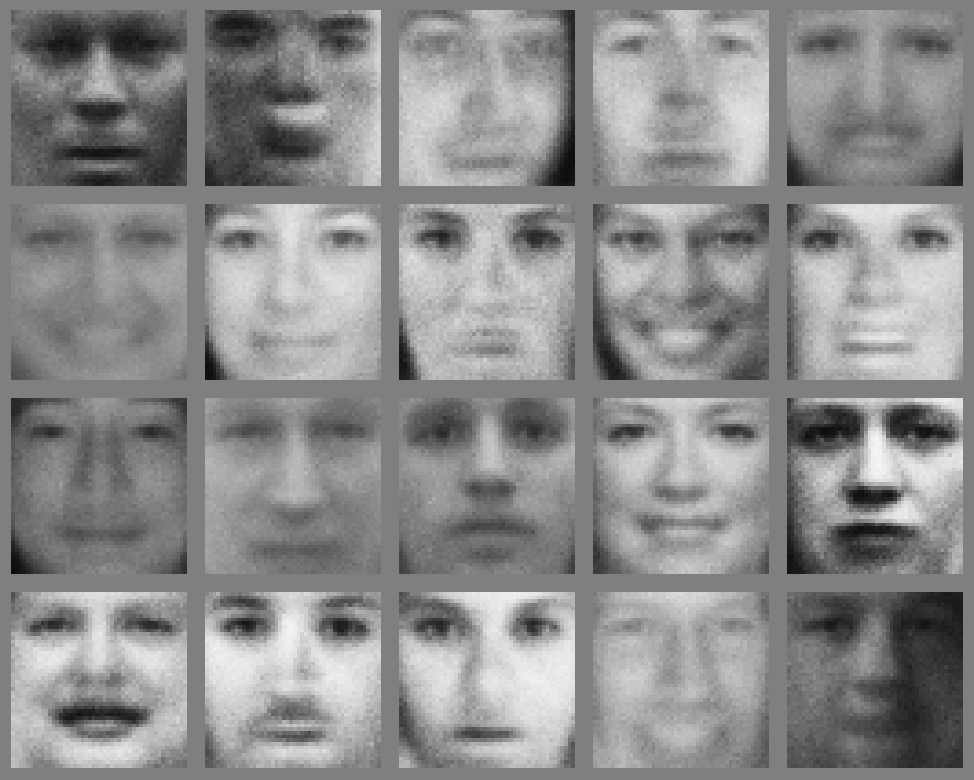

We indeed live in exciting times with respect to the development of machine learning. 
Let's look a bit into the history of machine learning. 

## Machine learning - not just a short-term hype, but a traditional CS discipline

The history of machine learning (ML) traces its origins back to the mid-20th century, emerging as a distinct field within artificial intelligence (AI). Notable early contributors, including Alan Turing and [Arthur Samuel](https://en.wikipedia.org/wiki/Arthur_Samuel_(computer_scientist)), laid the groundwork by exploring how computers could learn from data, exemplified by Samuel's development of a self-improving checkers (German: "Dame") program.

Over the decades, machine learning has evolved through key milestones, including the introduction of the perceptron algorithm in 1957 by [Frank Rosenblatt](https://en.wikipedia.org/wiki/Frank_Rosenblatt), which mimicked basic neural functions and served as a precursor to modern neural networks. Despite early advancements, the field faced significant challenges, notably during the "AI Winter" from the late 1970s to the early 1990s, when a [critical report](https://www.chilton-computing.org.uk/inf/literature/reports/lighthill_report/p001.htm) by Sir James Lighthill highlighted the gap between AI promises and actual outcomes, leading to reduced funding and interest in the discipline.

However, machine learning research continued and models such as boosting ([Freund and Shapire, 1996](https://citeseerx.ist.psu.edu/document?repid=rep1&type=pdf&doi=d186abec952c4348870a73640bf849af9727f5a4)) and decision tree models (e.g. [Breiman, 2001](https://link.springer.com/content/pdf/10.1023/a:1010933404324.pdf)) have been developed further and
advanced in a multitude of publications.

Starting around 2010, a transformative era for machine learning started, characterized by the rise of deep learning fueled by the availability of big data and advanced computational resources. Techniques such as convolutional neural networks and the adoption of graphics processing units (GPUs) significantly enhanced model performance, leading to breakthroughs in diverse applications, including image classification and natural language processing. 

For computer vision, the important breakthrough was the [winning entry](https://proceedings.neurips.cc/paper/2012/file/c399862d3b9d6b76c8436e924a68c45b-Paper.pdf) for the ImageNet 2012 challenge by
Alex Krizhevsky, Ilya Sutskever and Geoffrey E. Hinton ([nobel laureate](https://www.nobelprize.org/prizes/physics/2024/press-release/) in physics 2024). They basically showed
that a convolutional neural networks can be applied to very challenging image classification tasks and that learning a neural networks with several layers ("deep") is indeed possible with some optimization tricks. Their algorithm reduced the error rate by 10 percent point, which resulted in an earthquake in the community. 
However, it is important to mention here that the underlying algorithms have been already
invented by [Yann Le Cun et al. in 1989](https://yann.lecun.com/exdb/publis/pdf/lecun-89e.pdf).

<iframe width="420" height="315" src="https://www.youtube.com/embed/FwFduRA_L6Q" frameborder="0"> </iframe>

Starting from 2012, researchers (and practioneers later on) moved to further developing these models instead of focusing on feature engineering algorithms. 
Around 2017, a similar development was observed for Natural Language Processing (NLP) tasks.
A seminal paper here is the transformer paper ([Vaswani et al., 2017](https://proceedings.neurips.cc/paper/2017/file/3f5ee243547dee91fbd053c1c4a845aa-Paper.pdf)), further used
in important works, such as BERT ([Devlin et al, 2019](https://arxiv.org/abs/1810.04805v2)).
These models have redefined natural language processing (NLP) through their ability to capture contextual relationships in language in an efficient manner. 

Today, machine learning is integral to numerous industries, continuously evolving with advancements in algorithms and architectures. 

## Computer vision is solved?

Let's look into some examples that demonstrate the use of machine learning in computer vision.
Basically, computer vision without machine learning is impossible for more than trivial applications. 
Whereas object detection, classification, and segmentation are classical tasks to be solved by learning from data, machine learning can also help in learning how to [match objects](https://matchinganything.github.io/) across frames in videos or how to perform [segmentation irrespective
of learned object classes](https://ai.meta.com/sam2/).

Even 3D-reconstruction algorithms benefited from learning certain priors of 3D structure (implicitly) from data:
<iframe width="420" height="315" src="https://www.youtube.com/embed/QtsiL-6rSuM" frameborder="0"> </iframe>

Instead of deriving information from images and videos, we can also develop algorithms for the oposite direction: from information (prompts) to images and videos.
This all started with Generative Adversarial Networks ([Goodfellow et al., 2014](https://proceedings.neurips.cc/paper_files/paper/2014/file/5ca3e9b122f61f8f06494c97b1afccf3-Paper.pdf)) in quite low-resolutional images:

An important next step was the application and the optimization of [diffusion learning](https://openaccess.thecvf.com/content/CVPR2022/papers/Rombach_High-Resolution_Image_Synthesis_With_Latent_Diffusion_Models_CVPR_2022_paper.pdf) to the problem 
of image generation by Robin Rombach, Björn Omner et al..
Just a few years after these first developments, it is now possible to generate short video clips with pretty high resolution: [~~Sora-1~~](https://www.youtube.com/watch?v=HK6y8DAPN_0)
<iframe width="420" height="315" src="https://www.youtube.com/embed/lEcg6AJ6DVY" frameborder="0"> </iframe>
