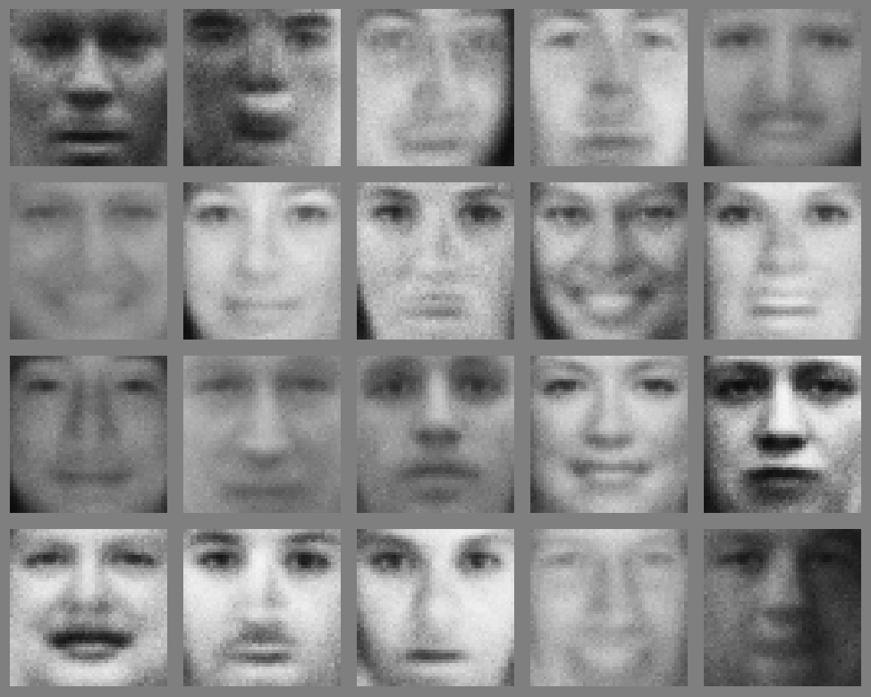

We indeed live in exciting times with respect to the development of machine learning. 
Let's look a bit into the history of machine learning. 

## Machine learning - not just a short-term hype, but a traditional CS discipline

The history of machine learning (ML) traces its origins back to the mid-20th century, emerging as a distinct field within artificial intelligence (AI). Notable early contributors, including Alan Turing and [Arthur Samuel](https://en.wikipedia.org/wiki/Arthur_Samuel_(computer_scientist)), laid the groundwork by exploring how computers could learn from data, exemplified by Samuel's development of a self-improving checkers (German: "Dame") program.

Over the decades, machine learning has evolved through key milestones, including the introduction of the perceptron algorithm in 1957 by [Frank Rosenblatt](https://en.wikipedia.org/wiki/Frank_Rosenblatt), which mimicked basic neural functions and served as a precursor to modern neural networks. Despite early advancements, the field faced significant challenges, notably during the "AI winters" of the 1970s and the late 1980s, when e.g. a [critical report](https://www.chilton-computing.org.uk/inf/literature/reports/lighthill_report/p001.htm) by Sir James Lighthill highlighted the gap between AI promises and actual outcomes, leading to reduced funding and interest in the discipline.

However, machine learning research continued and models such as boosting ([Freund and Schapire, 1996](https://citeseerx.ist.psu.edu/document?repid=rep1&type=pdf&doi=d186abec952c4348870a73640bf849af9727f5a4)) and random forests (e.g. [Breiman, 2001](https://link.springer.com/content/pdf/10.1023/a:1010933404324.pdf)) have been developed further and
advanced in a multitude of publications.

Starting around 2010, a transformative era for machine learning started, characterized by the rise of deep learning fueled by the availability of big data and advanced computational resources. Techniques such as convolutional neural networks and the adoption of graphics processing units (GPUs) significantly enhanced model performance, leading to breakthroughs in diverse applications, including image classification and natural language processing. 

For computer vision, the important breakthrough was the [winning entry](https://proceedings.neurips.cc/paper/2012/file/c399862d3b9d6b76c8436e924a68c45b-Paper.pdf) for the ImageNet 2012 challenge by
Alex Krizhevsky, Ilya Sutskever and Geoffrey E. Hinton ([Nobel laureate](https://www.nobelprize.org/prizes/physics/2024/press-release/) in physics 2024). They basically showed
that convolutional neural networks can be applied to very challenging image classification tasks and that learning a neural network with several layers ("deep") is indeed possible with some optimization tricks. Their algorithm reduced the error rate by about 10 percentage points, which resulted in an earthquake in the community. 
However, it is important to mention here that the underlying algorithms have been already
invented by [Yann LeCun et al. in 1989](https://yann.lecun.com/exdb/publis/pdf/lecun-89e.pdf).

<iframe width="420" height="315" src="https://www.youtube.com/embed/FwFduRA_L6Q" frameborder="0"> </iframe>

Starting from 2012, researchers (and practitioners later on) moved to further developing these models instead of focusing on feature engineering algorithms. 
Around 2017, a similar development was observed for Natural Language Processing (NLP) tasks.
A seminal paper here is the transformer paper ([Vaswani et al., 2017](https://proceedings.neurips.cc/paper/2017/file/3f5ee243547dee91fbd053c1c4a845aa-Paper.pdf)), further used
in important works, such as BERT ([Devlin et al., 2019](https://arxiv.org/abs/1810.04805v2)).
These models have redefined natural language processing (NLP) through their ability to capture contextual relationships in language in an efficient manner. 
Scaling such models up (e.g. GPT-3, [Brown et al., 2020](https://arxiv.org/abs/2005.14165)) and fine-tuning them with human feedback ([Ouyang et al., 2022](https://arxiv.org/abs/2203.02155)) led to ChatGPT (2022) and today's large language models (LLMs).
Since 2024, LLMs are additionally trained with reinforcement learning to generate intermediate reasoning steps before answering (e.g. [DeepSeek-R1, 2025](https://arxiv.org/abs/2501.12948)) and are increasingly used as agents that call tools or write and run code.

Today, machine learning is integral to numerous industries, continuously evolving with advancements in algorithms and architectures. 

## Computer vision is solved?

Let's look into some examples that demonstrate the use of machine learning in computer vision.
Basically, computer vision without machine learning is impossible for more than trivial applications. 
Object detection, classification, and segmentation are classical tasks learned from data, traditionally for a fixed set of object classes.
More recently, large *promptable foundation models* trained on millions of images have relaxed this restriction, at least for the kind of everyday objects that are well covered by web-scale data:
[Segment Anything](https://arxiv.org/abs/2304.02643) (2023) and [SAM 2](https://ai.meta.com/sam2/) (2024) segment and track an object given a click or a box,
and [SAM 3](https://ai.meta.com/research/publications/sam-3-segment-anything-with-concepts/) (2025) finds, segments and tracks all instances of a concept given a short text prompt such as "yellow school bus":
<iframe width="420" height="315" src="https://www.youtube.com/embed/G4OLPDjwncw" frameborder="0"> </iframe>

Related models detect objects described in natural language ([Grounding DINO](https://arxiv.org/abs/2303.05499)), estimate depth from a single image ([Depth Anything](https://depth-anything.github.io/)), follow points through a video ([CoTracker](https://co-tracker.github.io/)), or [match objects](https://matchinganything.github.io/) across frames.
Important building blocks are joint vision-language pretraining ([CLIP, Radford et al., 2021](https://arxiv.org/abs/2103.00020)) and self-supervised image features such as [DINOv3](https://ai.meta.com/dinov3/).
Despite the "anything" in their names, these models work best on domains similar to their training data - specialized applications (e.g. industrial inspection or medical imaging) often still require collecting data and fine-tuning.

Even 3D-reconstruction algorithms benefited from learning certain priors of 3D structure (implicitly) from data:
<iframe width="420" height="315" src="https://www.youtube.com/embed/QtsiL-6rSuM" frameborder="0"> </iframe>

Recent models such as [VGGT](https://vgg-t.github.io/) (Wang et al., CVPR 2025) go one step further and predict camera poses and dense 3D point maps from a set of images in a single forward pass of a neural network.

Instead of deriving information from images and videos, we can also develop algorithms for the opposite direction: from information (prompts) to images and videos.
This all started with Generative Adversarial Networks ([Goodfellow et al., 2014](https://proceedings.neurips.cc/paper_files/paper/2014/file/5ca3e9b122f61f8f06494c97b1afccf3-Paper.pdf)) in quite low-resolution images:

An important next step was the application and the optimization of [diffusion learning](https://openaccess.thecvf.com/content/CVPR2022/papers/Rombach_High-Resolution_Image_Synthesis_With_Latent_Diffusion_Models_CVPR_2022_paper.pdf) to the problem 
of image generation by Robin Rombach, Björn Ommer et al.
Just a few years after these first developments, it is now possible to generate short video clips with pretty high resolution: [Sora (OpenAI, 2024)](https://www.youtube.com/watch?v=HK6y8DAPN_0).
Since 2025, models such as Veo 3 (Google DeepMind) and Sora 2 (OpenAI) also generate matching audio together with the video - the video below shows examples of Sora 2:
<iframe width="420" height="315" src="https://www.youtube.com/embed/lEcg6AJ6DVY" frameborder="0"> </iframe>

## From video generation to world models

A related research direction are *world models*: models that learn how a scene evolves over time, in particular in response to actions of an agent.
[Genie 3](https://deepmind.google/discover/blog/genie-3-a-new-frontier-for-world-models/) (Google DeepMind, 2025) generates an environment from a text prompt that can be navigated interactively for a few minutes:
<iframe width="420" height="315" src="https://www.youtube.com/embed/PDKhUknuQDg" frameborder="0"> </iframe>

[V-JEPA 2](https://ai.meta.com/vjepa/) (Meta, 2025) learns from videos to predict future states in a learned feature space and has been used for planning simple robot manipulation tasks.
[NVIDIA Cosmos](https://www.nvidia.com/en-us/ai/cosmos/) provides models to generate synthetic training data for robotics and autonomous driving.
These systems are impressive demos, but their physical consistency over longer time spans is still limited - so no, computer vision is not solved yet.
